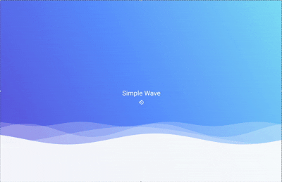
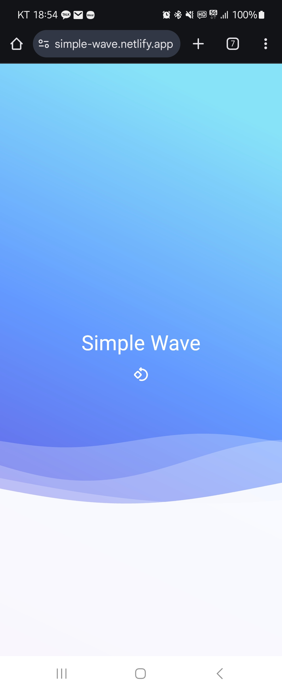
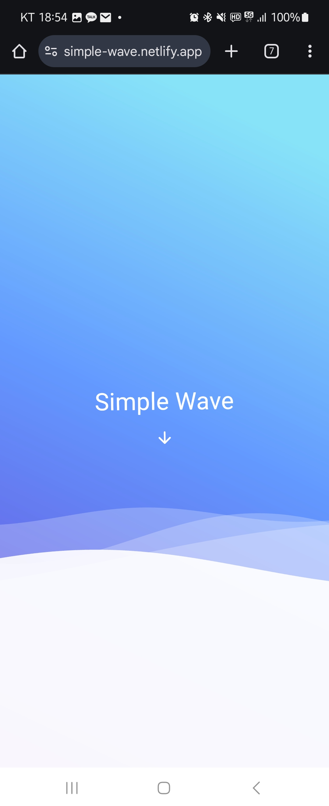
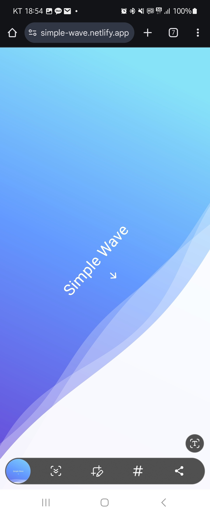

  
# 🌊 Simple Wave

### 기기의 움직임에 반응하는 물결 효과를 구현한 모션 인터랙션 프로젝트

*모바일 디바이스의 움직임에 반응하는 물결 인터페이스*

## 📋 프로젝트 소개

**Simple Wave**는 Flutter에서의 사용자 인터랙션과 커스텀 페인터를 공부하기 위한 프로젝트입니다. 기기의 가속도계 데이터를 활용하여 사용자의 움직임과 UI(물결 효과 등) 간의 연결을 구현합니다.

이 프로젝트를 통해 물리 기반 애니메이션, 센서 데이터 처리, 그리고 부드러운 시각 효과 구현 기술을 실험하고 개발했습니다.

## ✨ 주요 기능

### 🌈 커스텀 UI
- **물결 애니메이션 및 UI** - 서로 다른 진폭, 주기, 길이를 가진 여러 레이어의 웨이브가 중첩되어 깊이감 있는 물결 효과를 생성합니다.
- **그라데이션 배경** - 보라색에서 하늘색으로 자연스럽게 이어지는 그라데이션이 애니메이션의 시각적 효과를 강화합니다.

### 📱 센서 기반 인터랙션
- **기기 기울기 감지** - 가속도계 센서를 이용해 기기의 방향을 실시간으로 감지하여 물결의 움직임에 반영합니다.

### 🧠 고급 알고리즘
- **적응형 스무딩** - 원형 데이터(각도)에 특화된 스무딩 알고리즘을 적용하여 자연스러운 전환 효과를 구현합니다.
- **수평 안정화** - 기기가 거의 수평일 때 발생하는 미세한 변동을 필터링하여 안정적인 사용자 경험을 제공합니다.

### 🎛️ 사용자 제어
- **인터랙션 토글** - 사용자가 버튼을 통해 기울기 감지 기능을 켜고 끌 수 있는 기능을 제공합니다.

## 📝 TODO

- [ ] 사용자 지정 테마 추가
- [ ] 물결 레이어 커스터마이징 옵션
- [ ] 애니메이션 속도 조절 기능
- [ ] 예외 처리 강화
- [ ] 단위 테스트 추가

## 🖼️ 스크린샷

  
  
  

